<div align="center">


[](https://git.io/typing-svg)

<br>


<br>

[](https://indian-food-delivery-sentiment-analysis-lug5wqpmv42siqiu2aisxa.streamlit.app/)
[](https://www.linkedin.com/in/devesh-shukla23)
[](https://github.com/DeveshShukla23)

</div>

---

## 🍕 About This Project
```python
project = {
    "name"      : "Indian Food Delivery Sentiment Intelligence System",
    "data"      : "1459 Real Reviews — Google Play Store",
    "apps"      : ["Zomato", "Swiggy", "Blinkit"],
    "models"    : 7,
    "best_model": "Random Forest — 91.10% Accuracy",
    "techniques": ["NLP", "TF-IDF", "VADER", "ML", "Deep Learning"],
    "deployment": "Live Streamlit Web App",
    "outcome"   : "🏆 Actionable business recommendations for food delivery companies"
}
```

> 💡 *"Customer reviews are a goldmine of business intelligence — if you know how to mine them."*

---

## 📊 Dataset — Real Multi-Source Data

<div align="center">

| 📱 Apps | 📝 Total Reviews | 🌍 Country | 🔗 Source |
|:---:|:---:|:---:|:---:|
| **Zomato • Swiggy • Blinkit** | **1,459** | **India 🇮🇳** | **Google Play Store** |

</div>

> ⚡ Data collected directly from Google Play Store using `google-play-scraper` — no Kaggle dataset used!

---

## 📈 Exploratory Data Analysis

### Rating Distribution
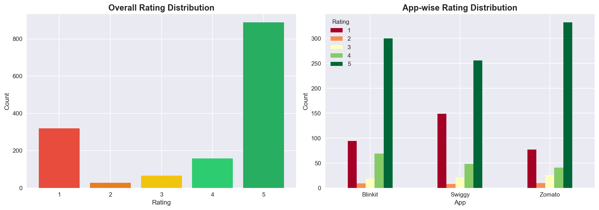

### Sentiment Distribution
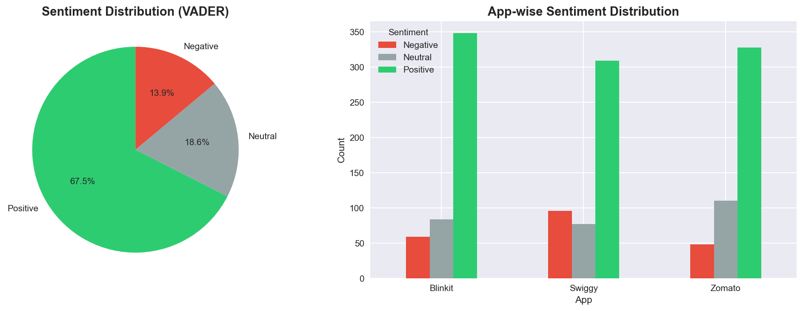

### Word Cloud Analysis
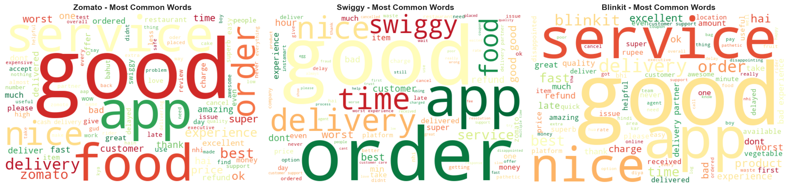

### Review Length Analysis
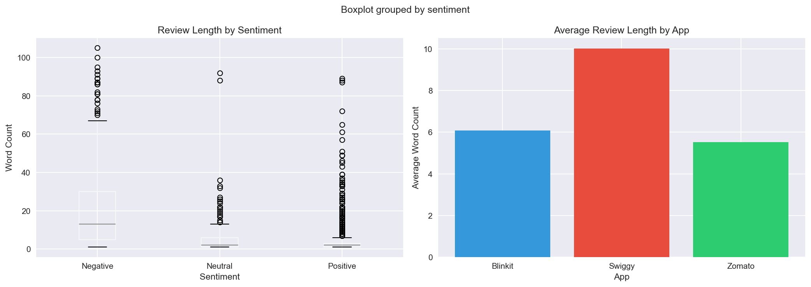

---

## 🤖 7 Models Built & Compared

<div align="center">

| Rank | Model | Type | Accuracy | F1 Score |
|:---:|:---:|:---:|:---:|:---:|
| 🥇 | **Random Forest** | ML Ensemble | **91.10%** | **91.25%** |
| 🥈 | SVM | ML | 89.73% | 89.82% |
| 🥉 | ANN | Deep Learning | 87.67% | 87.45% |
| 4 | Logistic Regression | ML | 86.99% | 87.71% |
| 5 | Naive Bayes | ML | 86.64% | 86.14% |
| 6 | Perceptron | Deep Learning | 82.19% | 81.90% |
| 7 | Decision Tree | ML | 73.63% | 76.31% |

</div>

> 💡 **Key Finding:** Random Forest beats ANN — for datasets under 5000 samples, traditional ML wins over Deep Learning!

### Model Comparison Charts

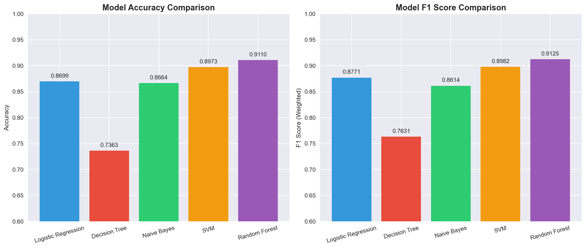
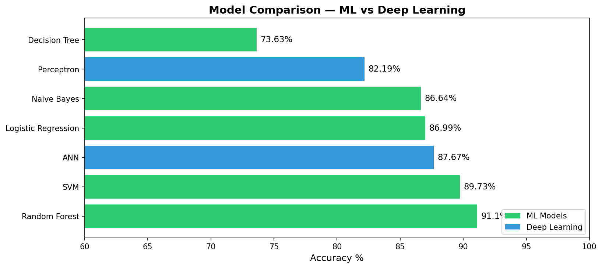
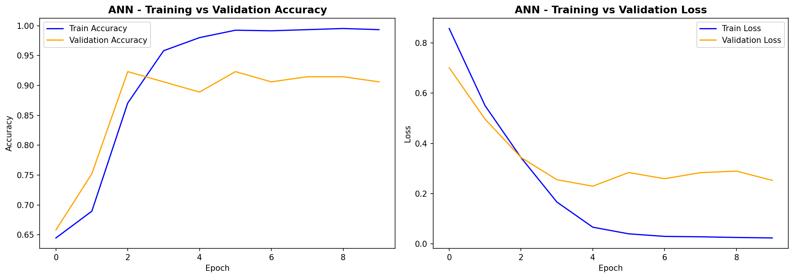
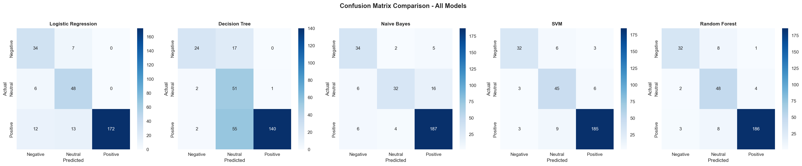

---

## 💡 Business Insights

### App-wise Sentiment & Satisfaction Score
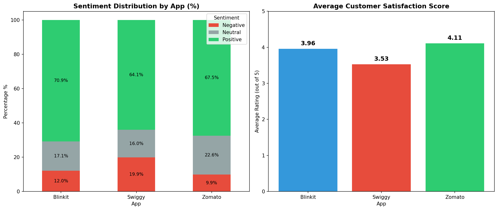

### Top Complaint Categories
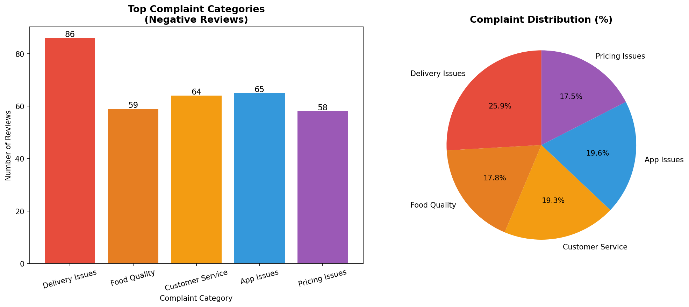

### Priority Areas for Improvement
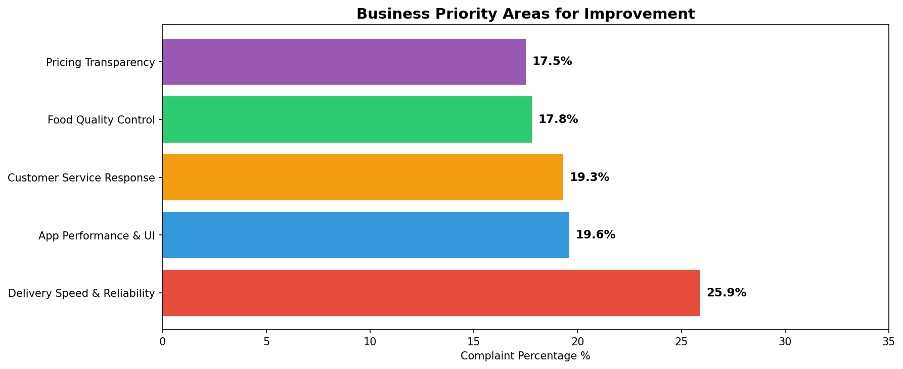
```
🚚  Delivery Speed    → #1 complaint — 25.9% of all negative reviews
😟  Swiggy            → highest negative sentiment (19.9%) among all apps
⭐  Zomato            → leads with best satisfaction score (4.11/5)
✍️  Negative reviews  → 5x longer than positive ones
📲  App Performance   → second biggest issue (19.6%)
💰  Pricing           → transparency complaints consistent across all apps
```

---

## 🖥️ Live Streamlit App

<div align="center">

| Feature | Details |
|:---:|:---:|
| 📱 Select App | Zomato / Swiggy / Blinkit |
| ✍️ Input | Any customer review text |
| 🎯 Output | Sentiment + Confidence Score |
| 💡 Insight | App-specific actionable recommendations |

### 👉 [Try the Live App Here!](https://indian-food-delivery-sentiment-analysis-lug5wqpmv42siqiu2aisxa.streamlit.app/)

</div>

---

## 📂 Project Structure
```
Indian-Food-Delivery-Sentiment-Analysis/
│
├── 01_Data_Collection.ipynb     → Data scraping & preprocessing
├── 02_EDA.ipynb                 → Visualizations & ML models
├── 03_Deep_Learning.ipynb       → ANN & Perceptron models
├── 04_Business_Insights.ipynb   → Business analysis & recommendations
├── app.py                       → Live Streamlit web application
├── processed_reviews.csv        → Cleaned & processed dataset
├── requirements.txt             → Python dependencies
├── *.png                        → All graphs and visualizations
└── README.md
```

---

## 🚀 Run Locally
```bash
git clone https://github.com/DeveshShukla23/Indian-Food-Delivery-Sentiment-Analysis.git
cd Indian-Food-Delivery-Sentiment-Analysis
pip install -r requirements.txt
streamlit run app.py
```

---

## 🛠️ Tech Stack

<div align="center">


</div>

---

## 🔮 Future Improvements
```
📦  Collect 5000+ reviews for better deep learning performance
🏗️  Build app-specific models for Zomato, Swiggy & Blinkit separately
⚡  Add real-time sentiment monitoring dashboard
🧠  Implement LSTM for better sequence understanding
🌐  Add Hindi/Hinglish review support for wider Indian audience
📊  Integrate Power BI dashboard for executive reporting
```

---

## 💡 Skills Demonstrated

<div align="center">

| NLP | Machine Learning | Deployment |
|:---:|:---:|:---:|
| ✅ Text Preprocessing | ✅ 7 Models Compared | ✅ Streamlit App |
| ✅ VADER Sentiment | ✅ Random Forest 91.10% | ✅ Live Deployment |
| ✅ TF-IDF Vectorization | ✅ ANN & Perceptron | ✅ Real Data Collection |
| ✅ Word Cloud | ✅ Model Evaluation | ✅ Business Insights |

</div>

---

## 👨‍💻 Author

<div align="center">

**Devesh Shukla**
*Data Analyst | NLP Engineer | Builder*

[](https://www.linkedin.com/in/devesh-shukla23)
[](https://github.com/DeveshShukla23)
[](https://indian-food-delivery-sentiment-analysis-lug5wqpmv42siqiu2aisxa.streamlit.app/)
[](https://github.com/DeveshShukla23/CHANAKYA)

<br>

⭐ **If you find this useful, please give it a star!** ⭐


</div>
